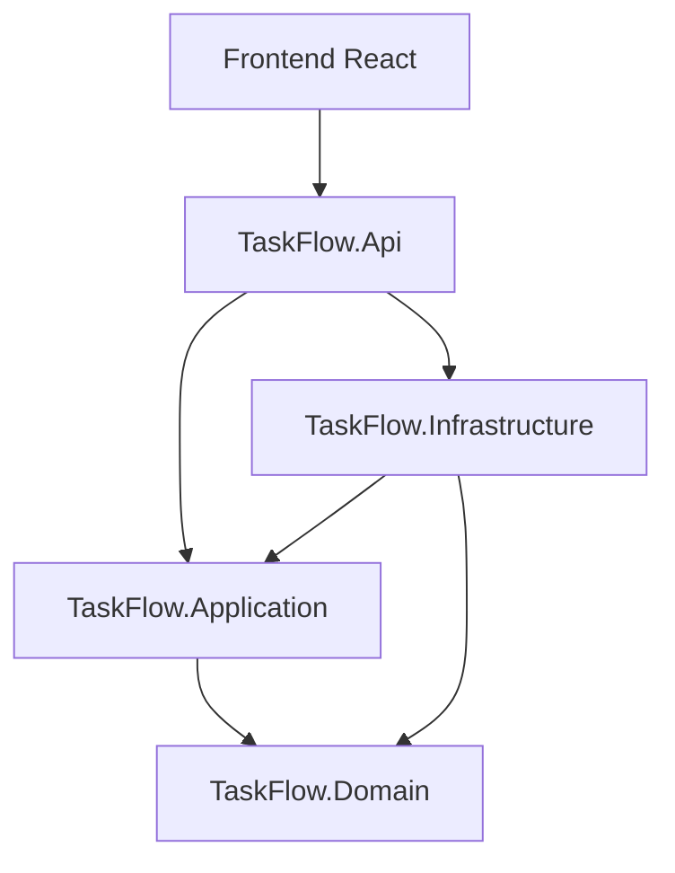

# Skill: Documento Funcional de Arquitectura (Markdown + Mermaid)

## Cuándo usar este skill

- El usuario pide "documentar la arquitectura", "crear un documento funcional de arquitectura", "explicar cómo se comunican las capas"
- Se necesita un documento visual (con diagramas) para explicar el sistema a alguien que no va a leer el código
- Se quiere complementar `docs/analisis-diseño.md` con diagramas de arquitectura más detallados y actualizados
- Antes de una revisión técnica, onboarding de un nuevo desarrollador, o entrega a cliente

## Procedimiento

### Paso 1 — Leer el contexto real del proyecto

No inventar la arquitectura: leerla del código y de la documentación existente.

- [`.github/copilot-instructions.md`](../../copilot-instructions.md) — stack, capas y convenciones
- [`docs/PRD-TaskFlow-Completo.md`](../../../docs/PRD-TaskFlow-Completo.md) — requisitos funcionales
- `docs/analisis-diseño.md` (si existe) — decisiones de diseño ya tomadas
- Estructura real de `backend/src/` (Domain, Application, Infrastructure, Api) y `frontend/src/`
- Entidades de dominio en `backend/src/TaskFlow.Domain/Entities/`
- Endpoints en `backend/src/TaskFlow.Api/` (Tasks/, Users/)

Si el código y la documentación previa no coinciden, prevalece el código.

### Paso 2 — Crear el documento

Crear `docs/documento-funcional-arquitectura.md` (o el nombre indicado por el usuario). El documento debe incluir estas secciones, en este orden:

#### 1. Propósito del documento
2-3 frases: qué es TaskFlow y qué cubre este documento (arquitectura, no requisitos funcionales detallados — eso vive en el PRD).

#### 2. Visión general de capas
Diagrama Mermaid `flowchart` mostrando las capas reales del backend (Api, Application, Domain, Infrastructure) y su dependencia hacia el frontend:

#### 3. Flujo de una petición típica
Diagrama Mermaid `sequenceDiagram` de un caso real (por ejemplo, crear una tarea): Frontend -> Api -> Application -> Domain/Infrastructure -> SQLite -> respuesta.

#### 4. Modelo de datos
Diagrama Mermaid `erDiagram` con las entidades reales (`Task`, `AppUser`) y su relación (FK opcional `AssignedUserId`, `SetNull` al borrar usuario).

#### 5. Estructura de carpetas
Árbol de carpetas real de `backend/` y `frontend/` (bloque de código, no Mermaid) con una línea de responsabilidad por carpeta.

#### 6. Decisiones arquitectónicas clave
Lista breve remitiendo a `docs/analisis-diseño.md` cuando exista, sin repetir el contenido completo.

#### 7. Entorno de desarrollo local
Puertos, HTTPS/HTTP y proxy (backend `https://localhost:5001`, frontend `http://localhost:5173`, proxy Vite `/api`).

### Paso 3 — Aplicar las reglas de sintaxis Mermaid

Todos los diagramas deben renderizar sin errores de parseo. Ver [`actualizar-documentacion`](../actualizar-documentacion/SKILL.md) para el detalle completo; resumen:

- Sin `\n` dentro de etiquetas de nodos
- Sin emojis en etiquetas
- Nombres de nodos en ASCII sin tildes (`diseno`, no `diseño`)
- Etiquetas de flecha cortas o ausentes: evitar `-->|"texto largo"|`
- Formas simples: `[texto]`, evitar `([texto])` o `[/texto/]`
- Si un diagrama no renderiza, simplificar hasta que funcione — claridad antes que estética

### Paso 4 — Validar

- Previsualizar el Markdown y comprobar que los diagramas se dibujan (vista previa de VS Code o GitHub)
- Releer cada diagrama contra el código real (nombres de proyectos, entidades, rutas) para confirmar que no hay invenciones
- No ejecutar la aplicación ni lanzar servidores para esta validación

### Paso 5 — Confirmar la creación

Informar la ruta del fichero generado y resumir en 3-4 líneas qué diagramas incluye y qué parte de la arquitectura real cubren.
