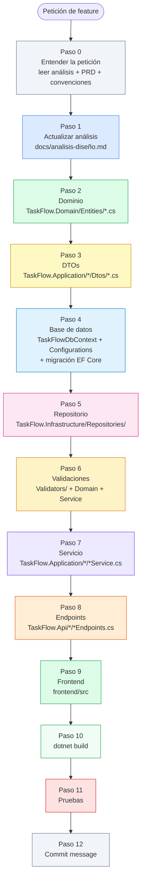

# Skill: Implementar una Feature Completa

## Cuándo usar este skill

- El usuario quiere añadir una **entidad nueva** (p. ej. `Tag`, `Comment`)
- El usuario quiere añadir un **campo nuevo** a una entidad existente (p. ej. `ReminderDate` en `TaskItem`)
- El usuario quiere añadir un **endpoint nuevo** que requiere cambios en varias capas
- El usuario pide "implementar X de principio a fin", "hacer todo el proceso para X", "añadir X a la aplicación"
- Cualquier cambio que toque más de dos capas simultáneamente

## Prerequisitos

- `docs/analisis-diseño.md` debe existir. Si no existe, ejecutar primero el skill `diseño-analisis`.
- [`docs/PRD-TaskFlow-Completo.md`](../../docs/PRD-TaskFlow-Completo.md) y `.github/copilot-instructions.md` deben existir con los requisitos y convenciones del proyecto.

---

## Procedimiento

### Paso 0 — Entender la petición

Leer los ficheros de contexto del proyecto antes de hacer nada:

- [`docs/analisis-diseño.md`](../../docs/analisis-diseño.md) — estado actual del modelo y endpoints
- [`docs/PRD-TaskFlow-Completo.md`](../../docs/PRD-TaskFlow-Completo.md) — requisitos y límites de alcance
- [`.github/copilot-instructions.md`](../copilot-instructions.md) — convenciones del proyecto

Identificar con precisión qué tipo de cambio implica la feature:

| Tipo de cambio | Capas afectadas |
|---|---|
| Nueva entidad con CRUD completo | Todas: análisis → Domain → DTOs → Infrastructure (BD + repositorio) → validaciones → Application (servicio) → Api (endpoints) |
| Campo nuevo en entidad existente | Domain → DTOs → Infrastructure (migración) → validaciones → servicio (mapeo) |
| Endpoint nuevo en entidad existente | Análisis → repositorio (si necesita nueva consulta) → servicio → endpoints |
| Relación entre entidades (FK) | Domain → DTOs → Infrastructure → validaciones (existencia de la FK) → servicio |

Si la petición es ambigua, inferir el alcance más probable y continuar — no preguntar. Recordar que el PRD excluye explícitamente multiusuario, autenticación y notificaciones salvo petición explícita.

---

### Paso 1 — Actualizar `docs/analisis-diseño.md`

Es la **fuente de verdad** de todos los skills siguientes. Actualizar antes de tocar código.

#### 1a. Sección 4 — Modelo de datos

Si la feature introduce una entidad nueva, añadirla con todos sus campos, tipos y restricciones.  
Si añade campos a una entidad existente, actualizarlos en la tabla correspondiente.  
Si establece una relación (FK), documentarla explícitamente.

#### 1b. Sección 5 — Endpoints API REST

Si la feature expone endpoints nuevos, añadirlos a la tabla con verbo, ruta, descripción y respuesta esperada.  
Si modifica la respuesta de endpoints existentes (por campos nuevos en el DTO de salida), actualizar su descripción.

Guardar `docs/analisis-diseño.md` antes de continuar al Paso 2.

---

### Paso 2 — Entidad de dominio (`TaskFlow.Domain/Entities/`)

Ejecutar el skill [`modelo`](../modelo/SKILL.md):

- Si es entidad nueva: crear `TaskFlow.Domain/Entities/<NuevaEntidad>.cs` con propiedades de solo lectura (`private set`), constructor privado sin parámetros para EF Core, constructor público con las reglas de validación, y métodos de comportamiento para cada transición de estado.
- Si son campos nuevos: añadirlos a la clase existente y a los métodos de comportamiento afectados (`Update`, etc.), respetando la nullability.
- Seguir todas las reglas del skill `modelo` (namespace `TaskFlow.Domain.Entities`, nombres en inglés, sin anotaciones de datos, encapsulación con comportamiento).

---

### Paso 3 — DTOs (`TaskFlow.Application/<Recurso>/Dtos/`)

Ejecutar el skill [`dto`](../dto/SKILL.md):

- Si es entidad nueva: crear `Create<Entidad>Request`, `Update<Entidad>Request`, `<Entidad>Dto` y, si el listado admite filtros, `<Entidad>FilterRequest`.
- Si son campos nuevos: añadir los campos a los contratos existentes del recurso afectado.
- Nunca exponer propiedades de navegación en los DTOs de salida; exponer solo los datos que necesita el cliente (p. ej. `assignedUserId` como `int?`, no el objeto `AppUser`).

---

### Paso 4 — Base de datos (`TaskFlow.Infrastructure/Persistence/`)

Ejecutar el skill [`base-de-datos`](../base-de-datos/SKILL.md):

- Añadir el `DbSet<NuevaEntidad>` a `TaskFlowDbContext` si es entidad nueva.
- Crear o actualizar su `IEntityTypeConfiguration<T>` en `Persistence/Configurations/`: longitudes máximas, campos requeridos, índices, relaciones y `OnDelete`.
- Generar la migración con un nombre descriptivo en PascalCase (p. ej. `AgregarTagATarea`, `AgregarReminderDateATaskItem`):

```bash
dotnet ef migrations add <NombreMigración> --project src/TaskFlow.Infrastructure --startup-project src/TaskFlow.Api --output-dir Persistence/Migrations
```

> **No aplicar la migración (`dotnet ef database update`) sin autorización explícita del usuario.** Verificar además que la migración no borra datos existentes.

---

### Paso 5 — Repositorio (`TaskFlow.Application/<Recurso>/I<Recurso>Repository.cs` + `TaskFlow.Infrastructure/Repositories/`)

Ejecutar el skill [`logica-negocio`](../logica-negocio/SKILL.md):

- Si es entidad nueva: crear `I<Entidad>Repository` en `TaskFlow.Application/<Recurso>/` y su implementación `<Entidad>Repository` en `TaskFlow.Infrastructure/Repositories/`, con los métodos de acceso a datos que necesite el servicio (`GetByIdAsync`, `GetAllAsync` con filtro, `AddAsync`, `Remove`, `SaveChangesAsync`).
- Si son operaciones nuevas en entidad existente: añadir el método de consulta necesario a la interfaz y la implementación existentes.
- Recordar: el repositorio trabaja con entidades de dominio, nunca con DTOs (salvo el `FilterRequest` de entrada para construir la consulta). Las reglas de negocio no viven aquí, viven en la entidad.

---

### Paso 6 — Validaciones

Ejecutar el skill [`validaciones`](../validaciones/SKILL.md):

- En `TaskFlow.Application/<Recurso>/Validators/`: crear o actualizar `Create<Entidad>RequestValidator` / `Update<Entidad>RequestValidator` con FluentValidation según las restricciones de la sección 4 del análisis.
- En la entidad de dominio: reforzar los guard clauses de los métodos de comportamiento afectados.
- En el servicio: si el DTO trae una FK opcional (p. ej. `AssignedUserId`), añadir la comprobación de existencia contra el repositorio correspondiente, lanzando `NotFoundException` si no existe.

---

### Paso 7 — Servicio (`TaskFlow.Application/<Recurso>/I<Recurso>Service.cs` + `<Recurso>Service.cs`)

Ejecutar el skill [`servicio`](../servicio/SKILL.md):

- Si es entidad nueva: crear `I<Entidad>Service` y `<Entidad>Service`, junto con `<Entidad>Mapper` (`ToDto()`).
- Si son métodos nuevos: añadirlos a la interfaz y la implementación existentes.
- El servicio invoca los métodos de comportamiento de la entidad, delega el acceso a datos al repositorio, y mapea con `ToDto()`.
- Registrar el servicio en `TaskFlow.Application/DependencyInjection.cs` (`AddApplication`) y el repositorio en `TaskFlow.Infrastructure/DependencyInjection.cs` (`AddInfrastructure`):
  ```csharp
  // TaskFlow.Infrastructure/DependencyInjection.cs
  services.AddScoped<I<Entidad>Repository, <Entidad>Repository>();

  // TaskFlow.Application/DependencyInjection.cs
  services.AddScoped<I<Entidad>Service, <Entidad>Service>();
  ```

---

### Paso 8 — Endpoints (`TaskFlow.Api/<Recurso>/<Recurso>Endpoints.cs`)

Ejecutar el skill [`controlador`](../controlador/SKILL.md):

- Si es entidad nueva: crear `TaskFlow.Api/<Recurso>/<Recurso>Endpoints.cs` con los endpoints definidos en la sección 5, usando `MapGroup` y los verbos Minimal API correspondientes.
- Si son endpoints nuevos en entidad existente: añadir el `Map<Verbo>` y el handler correspondiente al grupo existente.
- El endpoint no contiene lógica de negocio: valida con `IValidator<T>` si aplica, llama al servicio y devuelve el `IResult` adecuado.
- Registrar el nuevo grupo en `Program.cs` con `app.Map<Entidad>sEndpoints();` si es un recurso nuevo.

---

### Paso 9 — Frontend (`frontend/`)

#### 9a. Valorar los patrones de diseño

Consultar el skill [`ui-ux-pro-max`](../ui-ux-pro-max/SKILL.md) antes de escribir código React.

> **Nota:** si `ui-ux-pro-max` solo tiene su ficha de catálogo, sin plantillas ni datos, continuar con el paso 9b aplicando los principios básicos (claridad, respuesta visible a cada acción, consistencia y accesibilidad). No inventes que lo has aplicado.

#### 9b. Implementar el frontend

Ejecutar el skill [`frontend-react`](../frontend-react/SKILL.md) para:

- Actualizar los tipos TypeScript en `frontend/src/types/<recurso>.ts` con los campos nuevos del DTO de salida.
- Actualizar (o crear) `frontend/src/api/<recurso>Api.ts` si hay endpoints nuevos.
- Actualizar (o crear) los hooks de TanStack Query en `frontend/src/hooks/use<Recurso>.ts`.
- Actualizar (o crear) el schema de Zod en `frontend/src/schemas/` y los componentes/formularios afectados.

Si `frontend/` no existe, saltar este paso.

---

### Paso 10 — Compilar y verificar

```bash
dotnet build
```

Resolver cualquier error de compilación antes de continuar. Los errores más frecuentes al añadir una feature nueva son:

- Namespace incorrecto en el fichero nuevo (debe ser `TaskFlow.<Capa>.<Recurso>[.Dtos|.Validators]`).
- `DbSet` o registro en `AddApplication`/`AddInfrastructure` olvidado (tanto `I<Entidad>Repository` como `I<Entidad>Service` deben tener su `AddScoped`).
- Mapeo incompleto en `<Entidad>Mapper` (campo nuevo no trasladado de la entidad al DTO).
- Migración no generada después de cambiar `TaskFlowDbContext` o su configuración Fluent API.
- Grupo de endpoints nuevo no registrado con `app.Map<Entidad>sEndpoints()` en `Program.cs`.

### Paso 11 — Pruebas

Ejecutar el skill [`tests-unitarios`](../tests-unitarios/SKILL.md) para cubrir el servicio y, si aplica, el repositorio y los endpoints nuevos en `backend/tests/TaskFlow.Application.Tests` y `backend/tests/TaskFlow.Api.Tests`. Si la feature toca el frontend, añadir o actualizar pruebas de componente (Vitest + Testing Library) y, si afecta a un recorrido completo, un test end to end con Playwright.

### Paso 12 — Generar el mensaje de commit

Ejecutar el skill [`commit-message`](../commit-message/SKILL.md) con el resumen de todos los ficheros creados o modificados.

---

## Diagrama de ejecución



---

## Ejemplos de uso

### Ejemplo 1 — Nueva entidad con CRUD

> "Añadir etiquetas (`Tag`) que se pueden asociar a una tarea"

Alcance detectado: entidad nueva con relación FK a `TaskItem`.  
Pasos ejecutados: todos (0 → 12).  
Ficheros creados: `TaskFlow.Domain/Entities/Tag.cs`, `TaskFlow.Application/Tags/Dtos/*.cs`, `TaskFlow.Application/Tags/ITagRepository.cs`, `TaskFlow.Application/Tags/ITagService.cs` + `TagService.cs` + `TagMapper.cs`, `TaskFlow.Application/Tags/Validators/*.cs`, `TaskFlow.Infrastructure/Repositories/TagRepository.cs`, `TaskFlow.Infrastructure/Persistence/Configurations/TagConfiguration.cs`, migración, `TaskFlow.Api/Tags/TagEndpoints.cs`.  
Ficheros modificados: `docs/analisis-diseño.md`, `TaskFlowDbContext.cs`, `TaskItem.cs` (FK opcional `TagId`), `TaskFlow.Application/DependencyInjection.cs`, `TaskFlow.Infrastructure/DependencyInjection.cs`, `Program.cs`.

### Ejemplo 2 — Campo nuevo en entidad existente

> "Añadir una fecha de recordatorio (`ReminderDate`) a las tareas"

Alcance detectado: campo nuevo, nullable, sin entidad nueva.  
Pasos ejecutados: 0, 1, 2 (campo + parámetro en `Update`), 3 (campo en DTOs), 4 (migración), 5 (sin cambios en el repositorio), 6 (validación de rango si aplica), 7 (mapeo del campo en `TaskMapper`), 8 (sin cambios en endpoints), 9, 10, 11, 12.  
Ficheros modificados: `docs/analisis-diseño.md`, `TaskItem.cs`, `Tasks/Dtos/*.cs`, `TaskItemConfiguration.cs`, `TaskMapper.cs`, `TaskService.cs` (si el campo participa en algún filtro), tipos y formulario del frontend.

### Ejemplo 3 — Endpoint nuevo sin entidad nueva

> "Endpoint para marcar varias tareas como completadas en una sola petición"

Alcance detectado: operación nueva en entidad existente, sin cambio de modelo.  
Pasos ejecutados: 0, 1 (nuevo endpoint en sección 5), 3 (DTO de entrada para el lote), 6 (validación del lote), 7 (método en `ITaskService`), 8 (handler `PATCH /api/tasks/complete-batch` en `TaskEndpoints`), 10, 11, 12.  
Pasos omitidos: 2 (sin cambio de entidad), 4 (sin cambio de `TaskFlowDbContext`), 5 (reutiliza `GetByIdAsync` existente).
