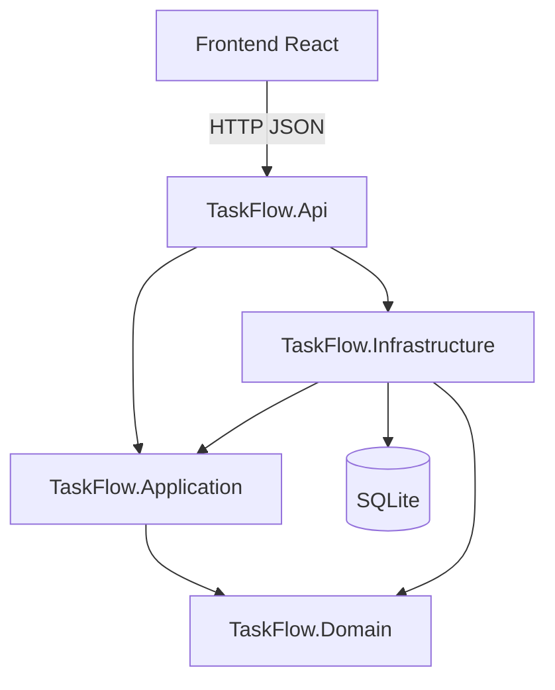
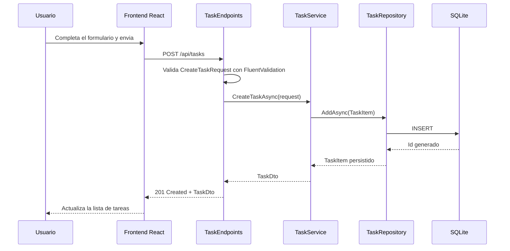
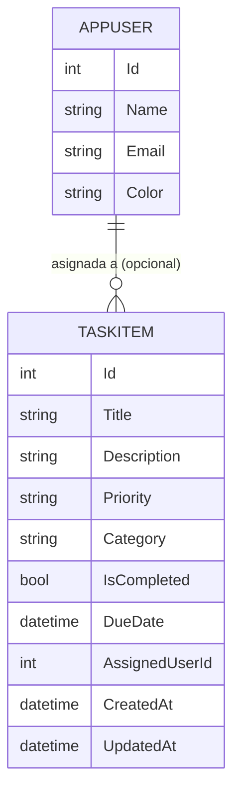

# Documento funcional de arquitectura — TaskFlow

## 1. Propósito del documento

Este documento explica **cómo está construida** TaskFlow a nivel de arquitectura: sus capas, cómo fluye una petición desde el navegador hasta la base de datos, su modelo de datos y su estructura de carpetas. No repite los requisitos funcionales ni las decisiones de diseño detalladas — esas viven en [`docs/PRD-TaskFlow-Completo.md`](./PRD-TaskFlow-Completo.md) y en [`docs/analisis-diseño.md`](./analisis-diseño.md) respectivamente. El objetivo es ofrecer un mapa visual, con diagramas Mermaid, para quien necesite entender el sistema sin leer todo el código.

## 2. Visión general de la aplicación

TaskFlow es una aplicación de gestión de tareas personales compuesta por un backend en .NET 10 (ASP.NET Core Minimal APIs + EF Core + SQLite) y un frontend en React + Vite + TypeScript. El backend expone una API REST sobre `/api/tasks` y `/api/users`; el frontend la consume mediante TanStack Query, sin recarga de página.

## 3. Visión general de capas



- **TaskFlow.Api**: define los endpoints HTTP (`TaskEndpoints`, `UserEndpoints`), valida con FluentValidation, gestiona CORS y el manejo global de excepciones, y compone la aplicación en `Program.cs`.
- **TaskFlow.Application**: contiene los casos de uso (`TaskService`, `UserService`), los DTOs de entrada/salida, los contratos de repositorio (`ITaskRepository`, `IUserRepository`) y los validadores.
- **TaskFlow.Domain**: entidades de dominio (`TaskItem`, `AppUser`) y enums (`TaskPriority`, `TaskStatusFilter`), sin dependencias hacia el resto de capas.
- **TaskFlow.Infrastructure**: implementa los repositorios definidos en `Application` usando EF Core sobre SQLite (`TaskFlowDbContext`, `Configurations/`, `Migrations/`, `DbInitializer`).
- **Frontend**: componentes React, hooks de TanStack Query (`useTasks`, `useUsers`), servicios de API (`tasksApi.ts`, `usersApi.ts`) y schemas Zod.

## 4. Flujo de una petición típica: crear una tarea



Si `AssignedUserId` viene informado y el usuario no existe, `TaskService` lanza `NotFoundException`, que el middleware de `Program.cs` traduce a `404 Not Found`. El mismo patrón (Endpoint -> Service -> Repository -> DbContext) se repite en el resto de operaciones (`GET`, `PUT`, `PATCH complete/reopen/assign`, `DELETE`).

## 5. Modelo de datos



`AssignedUserId` es una FK opcional (`0..N` tareas por usuario). Al eliminar un `AppUser`, sus tareas asignadas quedan con `AssignedUserId = null` (`ON DELETE SET NULL`); nunca se eliminan tareas en cascada.

## 6. Estructura de carpetas

```text
backend/
├── src/
│   ├── TaskFlow.Api/
│   │   ├── Program.cs           # composicion: DI, CORS, manejo de excepciones, mapeo de endpoints
│   │   ├── Tasks/                # TaskEndpoints.cs, TaskQueryParameters.cs
│   │   └── Users/                # UserEndpoints.cs
│   ├── TaskFlow.Application/
│   │   ├── Tasks/                # ITaskService, TaskService, ITaskRepository, TaskMapper, Dtos/, Validators/
│   │   ├── Users/                # equivalente para AppUser
│   │   └── Common/               # NotFoundException, ConflictException
│   ├── TaskFlow.Domain/
│   │   ├── Entities/              # TaskItem.cs, AppUser.cs
│   │   └── Enums/                 # TaskPriority, TaskStatusFilter
│   └── TaskFlow.Infrastructure/
│       ├── Persistence/           # TaskFlowDbContext, Configurations/, Migrations/, DbInitializer
│       └── Repositories/          # TaskRepository.cs, UserRepository.cs
└── tests/
    ├── TaskFlow.Application.Tests/
    └── TaskFlow.Api.Tests/

frontend/
├── src/
│   ├── api/                       # tasksApi.ts, usersApi.ts, ApiError.ts
│   ├── hooks/                     # useTasks.ts, useUsers.ts (TanStack Query)
│   ├── components/                # TaskForm, TaskList, TaskItem, UserManager, ConfirmDialog...
│   ├── schemas/                   # validacion Zod
│   └── types/                     # tipos TypeScript espejo de los DTOs
└── e2e/                           # tests Playwright
```

## 7. Decisiones arquitectónicas clave

Resumen; la justificación completa está en `docs/analisis-diseño.md` (sección 6):

- SQLite como base de datos local, sin servidores externos.
- ASP.NET Core Minimal APIs en lugar de Controllers, por la simplicidad del CRUD.
- Separación estricta Domain / Application / Infrastructure / Api, con dependencias unidireccionales.
- DTOs explícitos: el dominio nunca se expone directamente en la API.
- `AppUser` es un catálogo de asignación simple, no un sistema de autenticación ni multiusuario (fuera de alcance del PRD).

## 8. Entorno de desarrollo local

- **Backend**: HTTPS en `https://localhost:5001` (dev cert de .NET). Swagger UI en `/swagger`, Scalar en `/scalar`.
- **Frontend**: HTTP en `http://localhost:5173` (Vite dev server).
- **Proxy**: Vite redirige `/api` hacia `https://localhost:5001` con `secure: false`, evitando el redirect 307 que perdería la cabecera `Authorization` si se apuntara a HTTP.
- **CORS**: el backend permite explícitamente el origen `http://localhost:5173`.
- **Base de datos**: `taskflow.db` (SQLite), migrada e inicializada por `DbInitializer` al arrancar.
