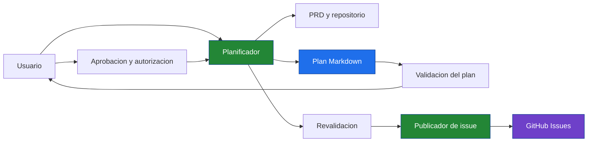
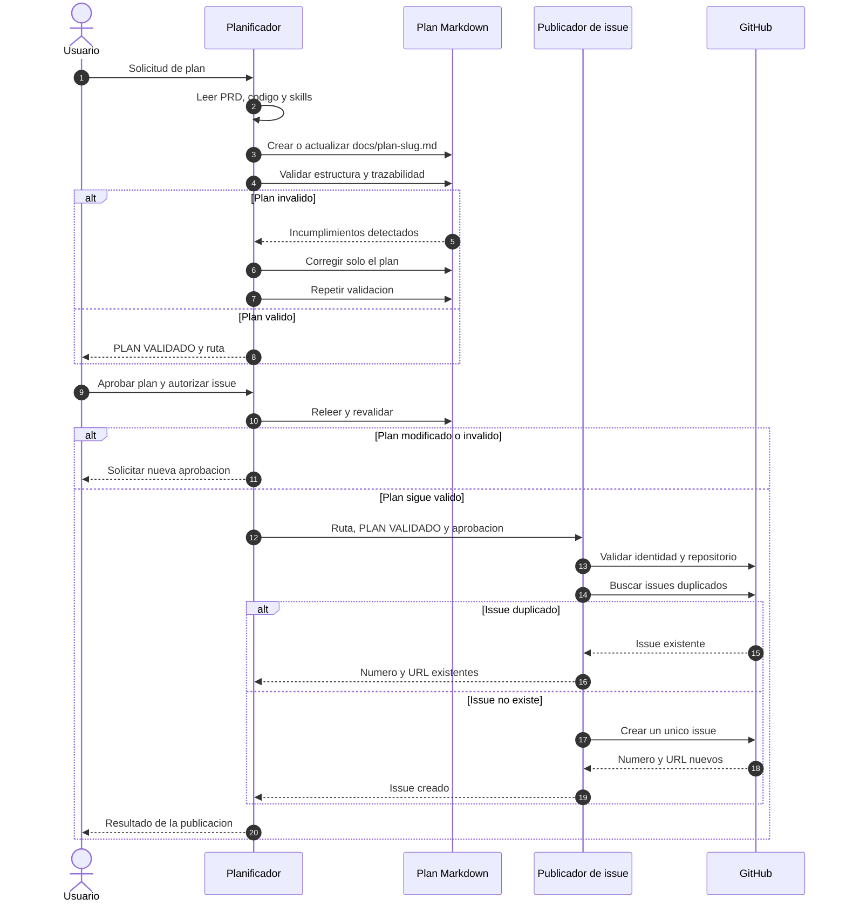
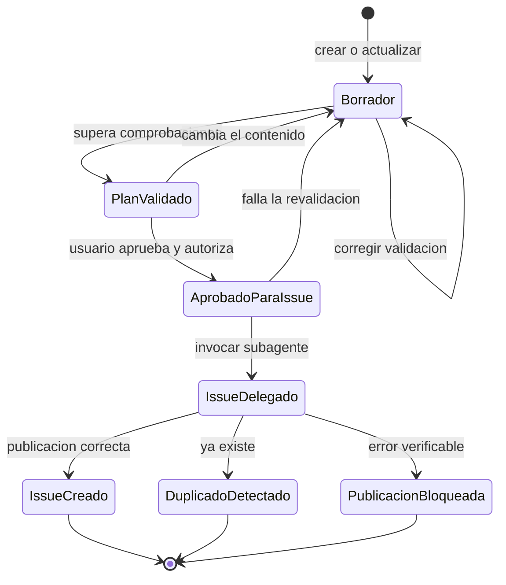
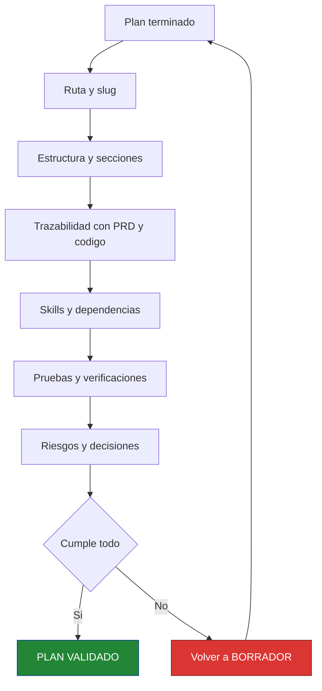
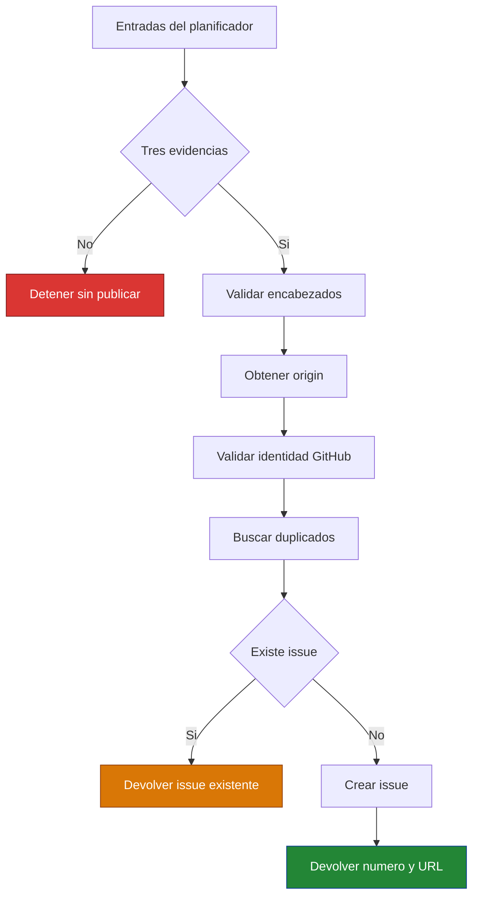

# Flujo de planificación, aprobación y creación de issues

Este documento describe el proceso coordinado entre el usuario, `planificador-apptodolist` y `creador-issue-desde-plan`. Cubre desde la petición inicial hasta la creación de un único issue de GitHub basado en un plan validado y aprobado.

Quedan fuera de este flujo la implementación del plan, la creación de ramas o pull requests, los commits y la ejecución de pruebas del producto.

---

## 1. Mapa del proceso

El usuario trabaja con el planificador. El publicador de issues permanece oculto como subagente y solo interviene después de que el plan sea válido, esté aprobado y exista autorización expresa para publicarlo.

### Participantes y responsabilidades

| Participante | Responsabilidad | Puede modificar |
|---|---|---|
| Usuario | Solicitar el plan, revisarlo, aprobarlo y autorizar su publicación | La decisión de aprobación |
| `planificador-apptodolist` | Analizar, crear, validar y revalidar el plan; delegar la publicación | Un único `docs/plan-*.md` |
| `creador-issue-desde-plan` | Verificar el repositorio, evitar duplicados y crear el issue | GitHub Issues |
| GitHub MCP | Consultar identidad, tipos e issues y ejecutar la creación | El issue solicitado |

---

## 2. Secuencia completa

La aprobación y la autorización son pasos distintos. Aprobar el contenido no basta por sí solo: el usuario también debe autorizar expresamente la creación del issue.

---

## 3. Estados del plan

El estado no se guarda como metadato dentro del documento. Representa la situación del flujo que mantiene el planificador durante la conversación.

| Estado | Significado | Acción permitida |
|---|---|---|
| `BORRADOR` | El plan se está creando, corrigiendo o ha cambiado | Editar y validar el plan |
| `PLAN VALIDADO` | El documento cumple todas las comprobaciones | Presentarlo al usuario |
| `APROBADO PARA ISSUE` | El usuario aprobó el contenido y autorizó publicarlo | Revalidar y delegar |
| `ISSUE DELEGADO` | El publicador recibió las tres evidencias obligatorias | Comprobar y publicar |

---

## 4. Validación previa a la aprobación

El planificador no presenta un borrador inválido para aprobación. Comprueba siete grupos de condiciones:

### Lista de comprobación

1. La ruta usa `docs/plan-<slug>.md`, con un slug ASCII, en minúsculas y kebab-case.
2. Los nueve encabezados obligatorios aparecen una sola vez, en orden y con contenido.
3. Los requisitos son verificables y coherentes con el PRD y la petición.
4. Las rutas, símbolos, endpoints y dependencias se han contrastado con el repositorio.
5. Los skills existen, cumplen sus prerrequisitos y están ordenados por dependencia.
6. La verificación cubre éxito, validación y error cuando corresponde, sin iniciar servidores.
7. Los riesgos, supuestos, decisiones pendientes y elementos fuera de alcance son explícitos.

Si alguna comprobación falla, el planificador modifica únicamente el plan y repite la validación.

---

## 5. Puerta de aprobación

El planificador entrega la ruta del documento y el estado `PLAN VALIDADO`. La respuesta del usuario debe contener dos decisiones inequívocas:

- Aprobación del contenido del plan.
- Autorización para crear el issue de GitHub.

Una confirmación ambigua, como `vale`, no abre la puerta de publicación. Un ejemplo suficiente es:

> Apruebo el plan `docs/plan-<slug>.md` y autorizo la creación del issue.

Después de recibirla, el planificador relee y revalida el archivo. Si el contenido cambió o dejó de cumplir alguna condición, la aprobación anterior deja de ser válida y debe solicitarse de nuevo.

---

## 6. Delegación al publicador

El planificador invoca `creador-issue-desde-plan` con tres entradas obligatorias:

1. Ruta exacta del `docs/plan-*.md`.
2. Estado `PLAN VALIDADO` emitido tras revisar la versión aprobada.
3. Aprobación y autorización textuales del usuario.

Sin cualquiera de estas evidencias, el subagente se detiene sin crear nada.

### Contenido del issue

- **Título:** el encabezado del plan sin el prefijo `Plan de implementación:`.
- **Primera línea:** ruta del plan de origen.
- **Cuerpo:** contenido completo del plan, sin repetir el encabezado H1.
- **Estado:** abierto.
- **Metadatos opcionales:** no se asignan usuarios, labels, milestones, tipo o campos salvo autorización expresa y existencia verificada.

---

## 7. Resultados y bloqueos

| Situación | Resultado |
|---|---|
| El plan no supera la validación | Se corrige y permanece en `BORRADOR` |
| El usuario no autoriza la publicación | No se invoca el subagente |
| El plan cambia después de aprobarse | Se invalida la aprobación y se solicita otra |
| Falta una entrada obligatoria | El publicador se detiene |
| El remoto no identifica un repositorio GitHub inequívoco | El publicador se detiene |
| Ya existe un issue equivalente | No crea otro; devuelve número y URL |
| GitHub devuelve un error | No intenta una publicación alternativa; informa del error |
| Todas las comprobaciones pasan | Crea un único issue y devuelve número, título y URL |

---

## 8. Archivos que definen el proceso

| Archivo | Responsabilidad |
|---|---|
| `.github/agents/planificador-apptodolist.agent.md` | Creación, validación, aprobación y delegación |
| `.github/agents/creador-issue-desde-plan.agent.md` | Comprobación de duplicados y publicación en GitHub |
| `.github/copilot-instructions.md` | Reglas transversales y registro de agentes |
| `docs/ARQUITECTURA-AGENTES.md` | Contexto general del equipo de agentes |
| `docs/plan-<slug>.md` | Fuente aprobada para el contenido del issue |

La separación mantiene una única responsabilidad por agente: el planificador controla la calidad y el consentimiento; el publicador controla la operación externa e idempotente sobre GitHub.