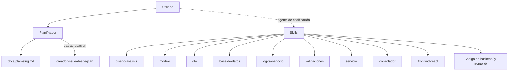
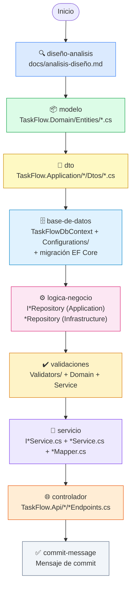
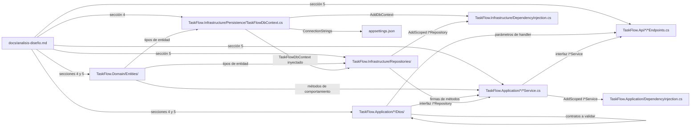
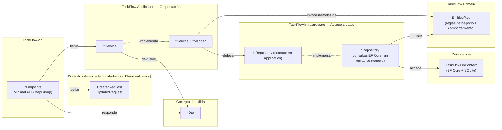
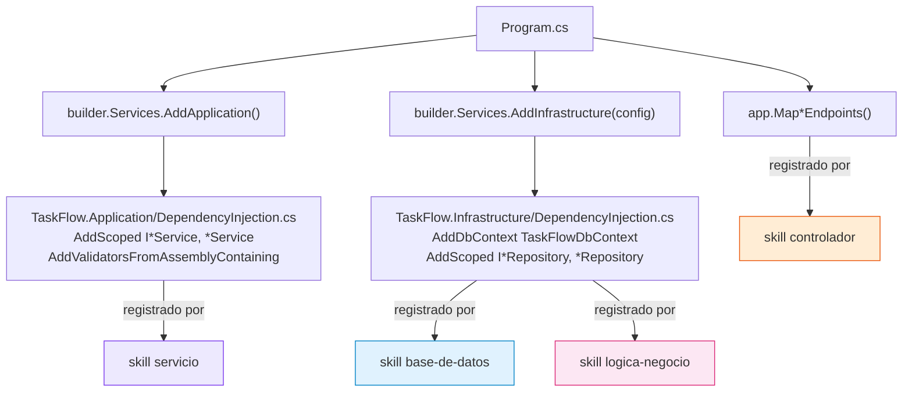

# Orquestación de Skills — TaskFlow

Este documento describe el conjunto de skills disponibles en el proyecto, su propósito, las dependencias entre ellos y cómo se coordinan para construir la aplicación de forma incremental.

---

## 0. Agentes vs. Skills: la arquitectura completa

Los **skills** son las herramientas. Los **agentes** son quienes las usan.



Un skill no decide cuándo actuar: describe **cómo** se hace algo dentro de la arquitectura real de TaskFlow (`TaskFlow.Domain`, `TaskFlow.Application`, `TaskFlow.Infrastructure`, `TaskFlow.Api`). El agente o el desarrollador es quien lee la petición, elige los skills y los ejecuta en orden. Por eso el catálogo de abajo se lee siempre desde quien lo va a usar.

---

## 1. Catálogo de skills

| Skill | Ubicación real generada | Responsabilidad |
|---|---|---|
| `diseño-analisis` | `docs/analisis-diseño.md` | Documento de análisis y diseño — fuente de verdad de todo lo demás |
| `documento-funcional-arquitectura` | `docs/` | Documento funcional en Markdown con la arquitectura ilustrada en diagramas Mermaid (capas, flujo de petición, modelo de datos, carpetas) |
| `modelo` | `backend/src/TaskFlow.Domain/Entities/` + `Enums/` | Entidades de dominio con comportamiento (métodos de transición de estado) y enums |
| `dto` | `backend/src/TaskFlow.Application/<Recurso>/Dtos/` | Contratos de entrada y salida de la API (`Create*Request`, `Update*Request`, `*Dto`, `*FilterRequest`) |
| `base-de-datos` | `backend/src/TaskFlow.Infrastructure/Persistence/` | `TaskFlowDbContext`, configuraciones Fluent API (`Configurations/`), migraciones, `DbInitializer` |
| `logica-negocio` | `backend/src/TaskFlow.Application/<Recurso>/I<Recurso>Repository.cs` + `backend/src/TaskFlow.Infrastructure/Repositories/` | Repositorio: acceso a datos vía `TaskFlowDbContext`, sin reglas de negocio (esas viven en la entidad) |
| `validaciones` | `TaskFlow.Application/<Recurso>/Validators/` + entidad + servicio | Reglas de FluentValidation, invariantes de la entidad y comprobación de FKs en el servicio |
| `servicio` | `backend/src/TaskFlow.Application/<Recurso>/I<Recurso>Service.cs` + `*Service.cs` + `*Mapper.cs` | Orquestación: invoca la entidad, delega en el repositorio, mapea a DTOs |
| `controlador` | `backend/src/TaskFlow.Api/<Recurso>/<Recurso>Endpoints.cs` | Grupos de Minimal APIs: recibe peticiones, valida, llama al servicio, devuelve `IResult` |
| `ui-ux-pro-max` | — | Patrones de diseño y accesibilidad. Se consulta **antes** del frontend; si solo trae la ficha de catálogo, se sigue con los principios básicos y se dice |
| `frontend-react` | `frontend/src/{types,api,hooks,schemas,components}` | Tipos TypeScript espejo de los DTOs, clientes fetch, hooks de TanStack Query, schemas Zod y componentes |
| `tests-unitarios` | `backend/tests/TaskFlow.Application.Tests`, `backend/tests/TaskFlow.Api.Tests`, `frontend/src/**/*.test.tsx`, `frontend/e2e/` | Pruebas xUnit + FluentAssertions, Vitest + Testing Library y Playwright |
| `nueva-feature` | _las que toque_ | **Detecta el alcance** de una petición en lenguaje natural y encadena los skills de las capas afectadas, del análisis al commit. No implementa nada por su cuenta: coordina a los demás |
| `actualizar-documentacion` | `docs/` | Audita la documentación contra el código real y corrige lo que se ha quedado desfasado |
| `github-flow` | — | Operaciones GitHub (issue → rama → PR), detectando `owner`/`repo` dinámicamente con `git remote -v` |
| `commit-message` | — | Genera el mensaje de commit siguiendo convenciones del proyecto |

---

## 2. Flujo de ejecución — orden obligatorio

Los skills tienen dependencias estrictas. El diagrama muestra el orden en que deben ejecutarse y qué artefacto produce cada uno:



---

## 3. Dependencias entre skills

Cada skill lee los artefactos de los skills anteriores como fuente de verdad. Nunca infiere ni inventa — si el prerequisito no existe, detiene la ejecución.



---

## 4. Arquitectura de capas generada

Una vez ejecutados todos los skills, la aplicación queda estructurada en capas con responsabilidades claramente separadas:



---

## 5. Flujo de una petición en runtime

Cómo viajan los datos desde el cliente HTTP hasta la base de datos y de vuelta, incluyendo las validaciones:

```mermaid
sequenceDiagram
    actor Cliente
    participant E as *Endpoints
    participant S as *Service
    participant D as Entidad (Domain)
    participant R as *Repository
    participant DB as TaskFlowDbContext

    Cliente->>E: POST /api/tasks\n{ "title": "..." }
    Note over E: IValidator&lt;CreateTaskRequest&gt; valida el request<br/>(reglas de FluentValidation)
    alt Validación inválida
        E-->>Cliente: 400 Bad Request\n{ Results.ValidationProblem }
    else Validación correcta
        E->>S: CreateTaskAsync(CreateTaskRequest)
        S->>D: new TaskItem(...)
        Note over D: Aplica invariantes<br/>(título obligatorio, etc.)
        alt Regla de dominio violada
            D-->>S: throws ArgumentException
            S-->>E: excepción propagada
            E-->>Cliente: 400 Bad Request
        else Todo correcto
            S->>R: AddAsync(task) + SaveChangesAsync()
            R->>DB: Add(task) + SaveChangesAsync()
            DB-->>R: task con Id asignado
            R-->>S: OK
            Note over S: Mapea entidad → TaskDto (TaskMapper)
            S-->>E: TaskDto
            E-->>Cliente: 201 Created\n{ "id": 1, "title": "...", ... }
        end
    end
```

---

## 6. Gestión de la inyección de dependencias

Cada skill que genera clases registrables actualiza el `DependencyInjection.cs` de su propia capa — nunca `Program.cs` directamente (salvo para llamar a `AddApplication()`/`AddInfrastructure()` y registrar el grupo de endpoints):



---

## 7. Cuándo usar cada skill

```mermaid
flowchart TD
    START([Nueva feature / nuevo recurso]) --> Q1{¿Existe\ndocs/analisis-diseño.md?}

    Q1 -->|No| DA["▶ Ejecutar\ndiseño-analisis"]
    Q1 -->|Sí| Q2{¿Existe la\nentidad de dominio?}
    DA --> Q2

    Q2 -->|No| MO["▶ Ejecutar\nmodelo"]
    Q2 -->|Sí| Q3{¿Existen\nlos DTOs?}
    MO --> Q3

    Q3 -->|No| DTO["▶ Ejecutar\ndto"]
    Q3 -->|Sí| Q4{¿Existe\nTaskFlowDbContext?}
    DTO --> Q4

    Q4 -->|No| BD["▶ Ejecutar\nbase-de-datos"]
    Q4 -->|Sí| Q5{¿Existe\nel repositorio?}
    BD --> Q5

    Q5 -->|No| LN["▶ Ejecutar\nlogica-negocio"]
    Q5 -->|Sí| Q6{¿Tiene\nvalidaciones?}
    LN --> Q6

    Q6 -->|No| VA["▶ Ejecutar\nvalidaciones"]
    Q6 -->|Sí| Q7{¿Existe\nel servicio?}
    VA --> Q7

    Q7 -->|No| SV["▶ Ejecutar\nservicio"]
    Q7 -->|Sí| Q8{¿Existen\nlos endpoints?}
    SV --> Q8

    Q8 -->|No| CT["▶ Ejecutar\ncontrolador"]
    Q8 -->|Sí| CM["▶ Ejecutar\ncommit-message"]
    CT --> CM

    CM --> END([Listo para commit])

    style DA  fill:#dbeafe,stroke:#3b82f6
    style MO  fill:#dcfce7,stroke:#16a34a
    style DTO fill:#fef9c3,stroke:#ca8a04
    style BD  fill:#e0f2fe,stroke:#0284c7
    style LN  fill:#fce7f3,stroke:#db2777
    style VA  fill:#fef3c7,stroke:#d97706
    style SV  fill:#ede9fe,stroke:#7c3aed
    style CT  fill:#ffedd5,stroke:#ea580c
    style CM  fill:#f1f5f9,stroke:#64748b
```



---

## 8. Convenciones de nomenclatura por capa

| Capa | Interfaz | Implementación | Ejemplo real |
|---|---|---|---|
| Repositorio (acceso a datos) | `I<Recurso>Repository` | `<Recurso>Repository` | `ITaskRepository` / `TaskRepository` |
| Servicio (orquestación) | `I<Recurso>Service` | `<Recurso>Service` | `ITaskService` / `TaskService` |
| Endpoints (Minimal API) | — | `<Recurso>Endpoints` | `TaskEndpoints` |
| Contrato de entrada — crear | — | `Create<Recurso>Request` | `CreateTaskRequest` |
| Contrato de entrada — actualizar | — | `Update<Recurso>Request` | `UpdateTaskRequest` |
| Contrato de salida | — | `<Recurso>Dto` | `TaskDto` |
| Contrato de filtro de listado | — | `<Recurso>FilterRequest` | `TaskFilterRequest` |
| Entidad de dominio | — | `<Recurso>` | `TaskItem` |
| Contexto de datos | — | `TaskFlowDbContext` | `TaskFlowDbContext` |
| Configuración Fluent API | — | `<Entidad>Configuration` | `TaskItemConfiguration` |
| Validador (FluentValidation) | — | `<Contrato>Validator` | `CreateTaskRequestValidator` |

